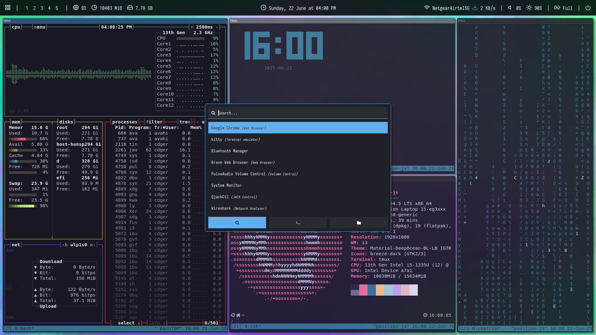
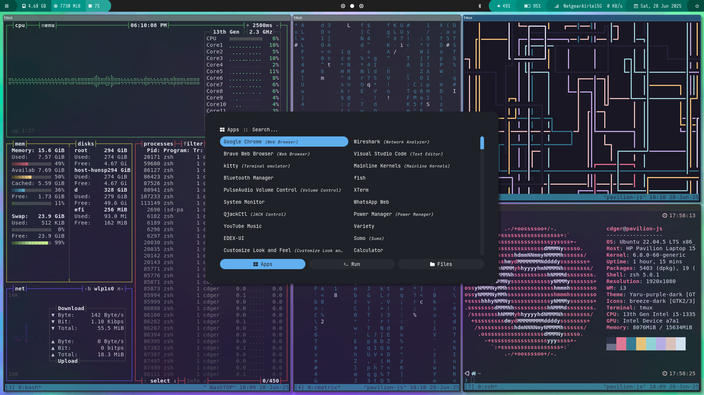

# dotfiles

## Themes
The default theme is ``shapes``. To change the theme, see ``~/.config/i3/config``.

### Forest


### Shapes


## Apply config
Install [chezmoi](https://www.chezmoi.io/install/).
Then,
```bash
chezmoi init --apply git@github.com:codegallivant/dotfiles.git
```

