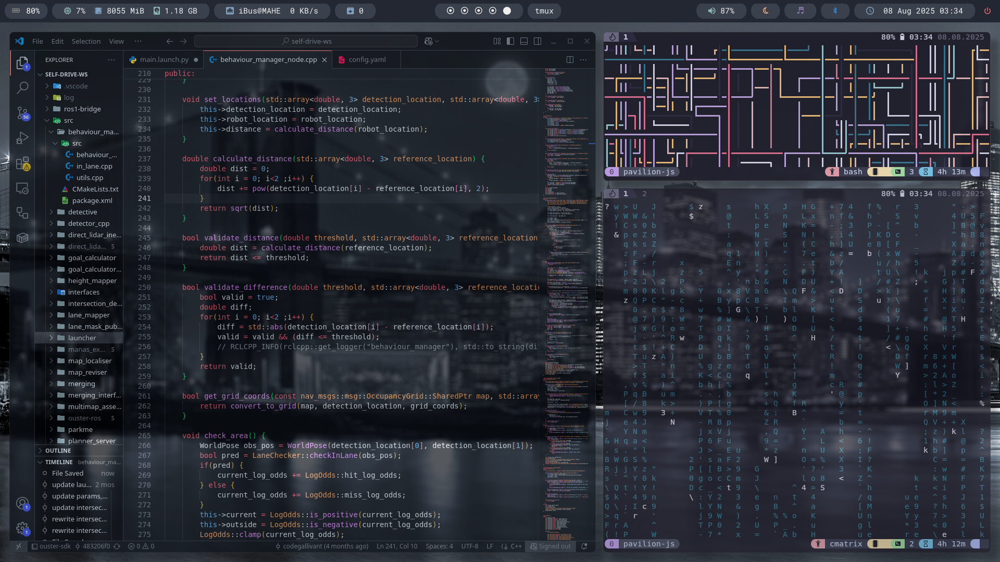
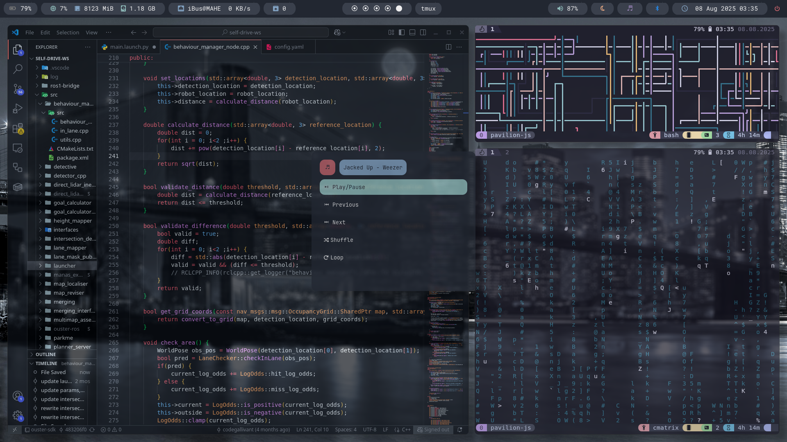
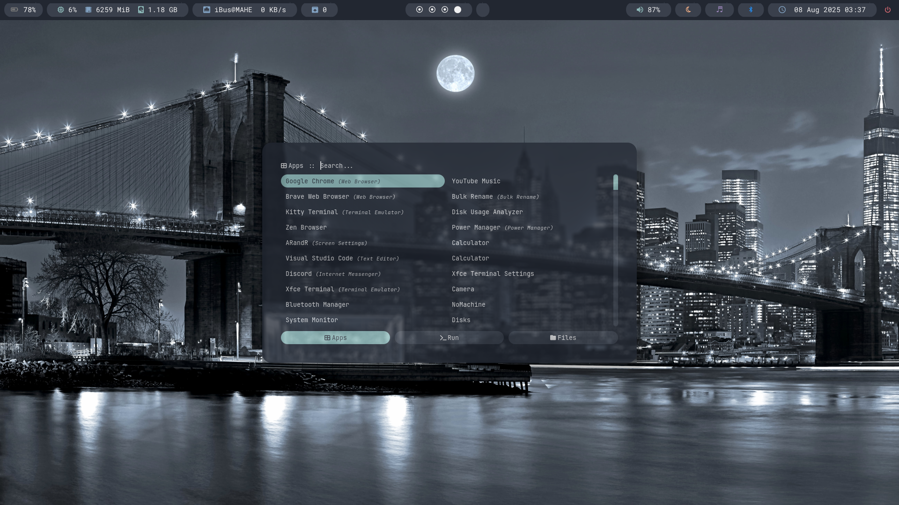
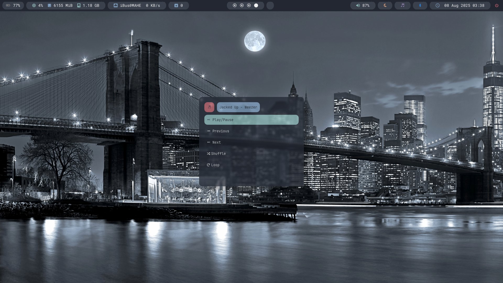
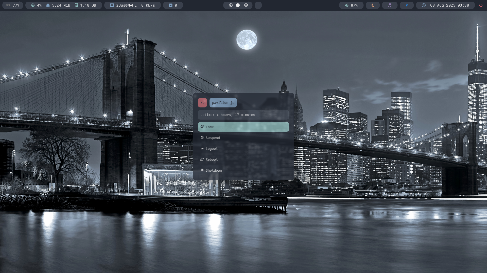

# dotfiles

my linux configuration files.

## Desc
- Display Server: [x11](https://gitlab.freedesktop.org/xorg/lib/libx11)
- Login Manager: [ly](https://github.com/fairyglade/ly)
- Window Manager: [i3](https://github.com/i3/i3)
- Compositor: [picom](https://github.com/yshui/picom)
- Launcher: [rofi](https://github.com/davatorium/rofi) ([various themes](https://github.com/adi1090x/rofi), modded colour scheme)
- Bar: [polybar](https://github.com/polybar/polybar) (colour schemes by various artists. some new modules.)
- Terminal Emulator: [kitty](https://github.com/kovidgoyal/kitty) ([rose-pine theme](https://github.com/rose-pine/kitty))
- Terminal Multiplexer: [tmux](https://github.com/xero/dotfiles/tree/main/tmux) ([catppuccin theme](https://github.com/catppuccin/tmux))
- Shells: [zsh](https://sourceforge.net/p/zsh/code/ci/master/tree/)([powerlevel10k](https://github.com/romkatv/powerlevel10k) on [oh-my-zsh](https://github.com/ohmyzsh/ohmyzsh)), [bash](https://cgit.git.savannah.gnu.org/cgit/bash.git/)([powerline-shell theme](https://github.com/b-ryan/powerline-shell))
- Notifications: [dunst](https://github.com/dunst-project/dunst) (config from [here](https://github.com/Kaligule/dunst-config))
- Lockscreen: [i3lock](https://github.com/i3/i3lock)
- Media Player Controller: [playerctl](https://github.com/altdesktop/playerctl)

## Themes
1. sch (default)
2. shapes 
3. forest
  
To change the theme, see ``~/.config/i3/config``.

### sch
<!--  -->


<!-- 
 -->
Note: Polybar colour/capsule scheme picked from https://github.com/schctl/dotfiles

### shapes


Note: Polybar colour scheme picked from https://github.com/adi1090x/polybar-themes

### forest

Note: Polybar colour scheme picked from https://github.com/adi1090x/polybar-themes

## Install configuration
1. Install [chezmoi](https://www.chezmoi.io/install/) and prerequisites [mentioned](#desc).
2. Run,
    ```bash
    chezmoi init --apply git@github.com:codegallivant/dotfiles.git
    ```

